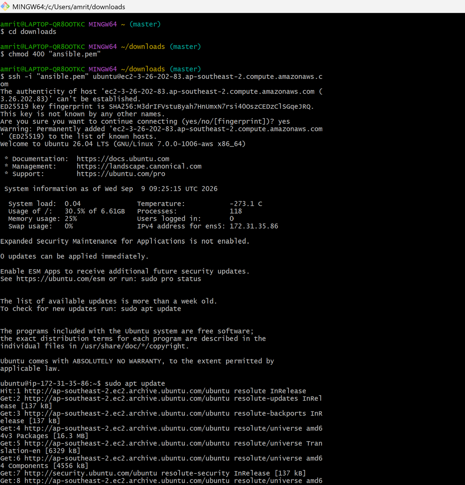
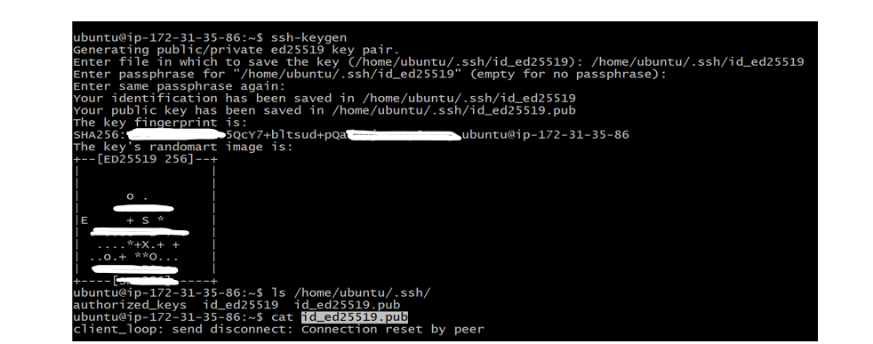
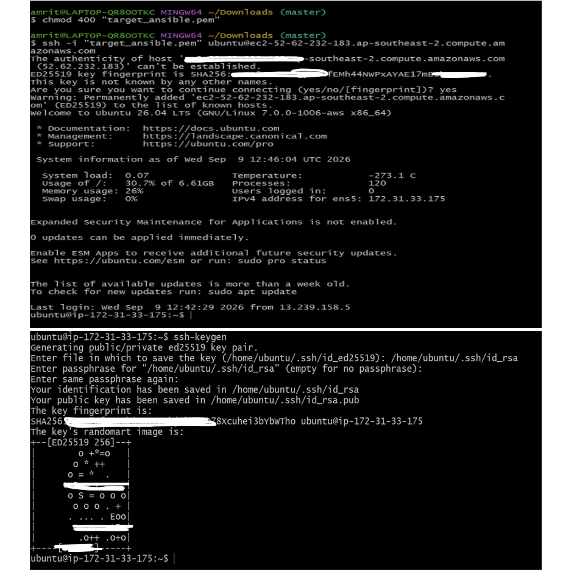
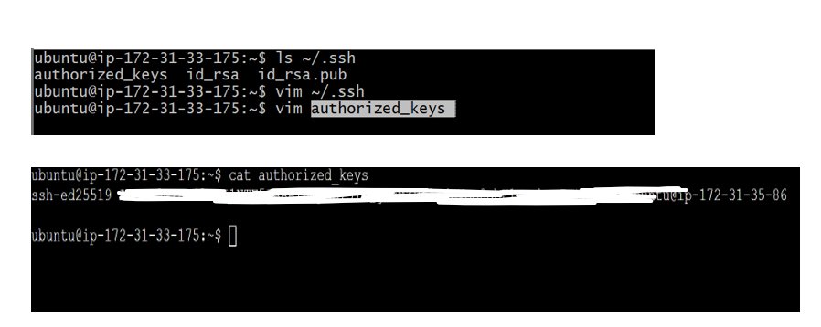
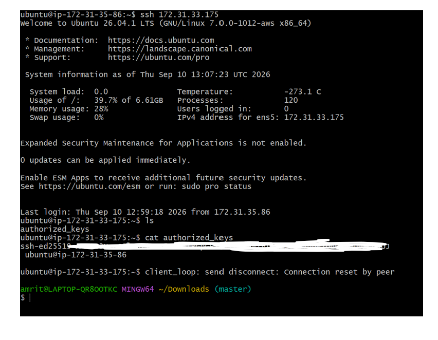
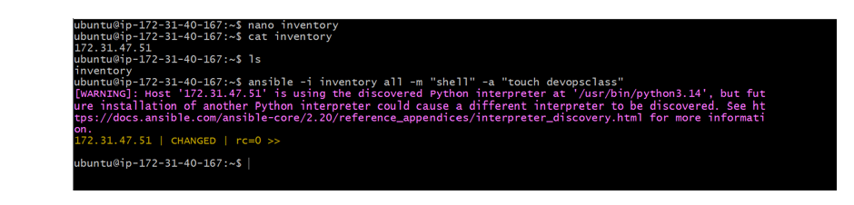
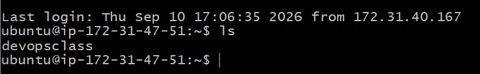
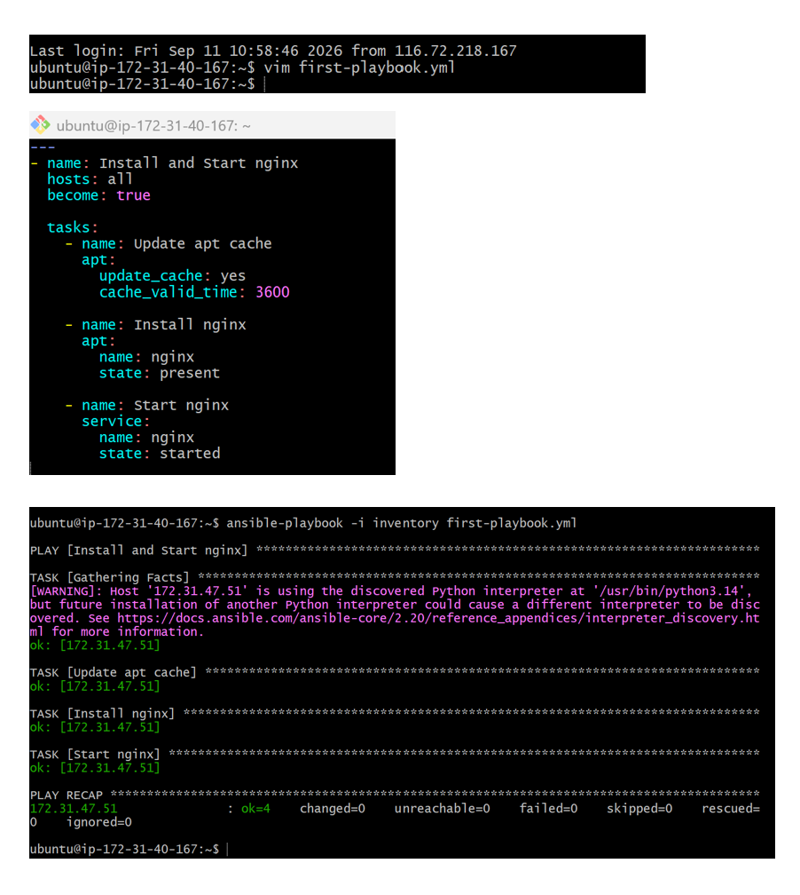
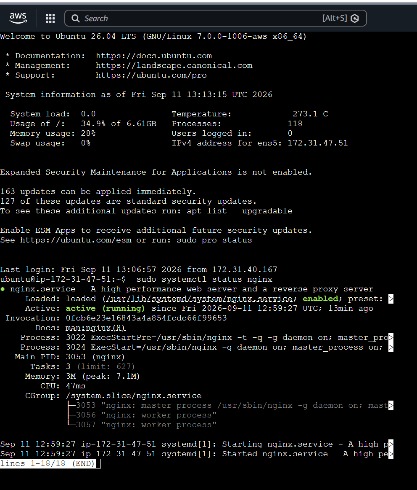

# Ansible Automation Project

## 📌 Overview

This project demonstrates server automation using **Ansible** with two Ubuntu AWS EC2 instances.

One EC2 instance is configured as the **Ansible Control Server**, while the second EC2 instance is used as the **Target Server**.

The project focuses on establishing passwordless SSH authentication, executing Ansible ad-hoc commands, creating Ansible playbooks, deploying Nginx, and initializing an Ansible role using Ansible Galaxy.

---

## 🛠️ Technologies Used

* AWS EC2
* Ubuntu Linux
* Ansible
* SSH
* Git Bash
* Ansible Ad-Hoc Commands
* Ansible Playbooks
* Ansible Roles
* Ansible Galaxy
* Nginx

---

## 🏗️ Project Architecture

```text
                    AWS EC2
                       │
          ┌────────────┴────────────┐
          │                         │
          ▼                         ▼
 ┌─────────────────┐       ┌─────────────────┐
 │  ansible-server │       │ target-server-  │
 │                 │ SSH   │    ansible      │
 │ Ansible Control │──────▶│                 │
 │     Server      │       │ Target Server   │
 └─────────────────┘       └─────────────────┘
          │                         │
          │                         │
          │    Ansible Commands     │
          └─────────────────────────┘
```

---

# 🚀 Project Process

## 1. Create AWS EC2 Instances

Two Ubuntu AWS EC2 instances were created for the project.


### Ansible Server

The first EC2 instance was named:

```text
ansible-server
```

This server was used as the **Ansible Control Server**.

### Target Server

The second EC2 instance was named:

```text
target-server-ansible
```

This server was used as the **Target Server** where Ansible tasks were executed.

---

## 2. Connect to the Ansible Server


The Ansible Control Server was accessed using **Git Bash and SSH**.

The server was used to configure Ansible and communicate with the target server.



---

## 3. Generate SSH Key on the Ansible Server

An SSH key pair was generated on the Ansible server using:

```bash
ssh-keygen
```

This generated the SSH key pair required for passwordless authentication.

The public key generated on the Ansible server was later configured on the target server.



---

## 4. Generate SSH Key on the Target Server

An SSH key pair was also generated on the target server using:

```bash
ssh-keygen
```

The SSH configuration was then prepared for authentication between the two servers.



---

## 5. Configure Passwordless SSH Authentication

The **public SSH key of the Ansible server** was added to the target server's:

```text
~/.ssh/authorized_keys
```

This allowed the Ansible server to authenticate with the target server without requiring a password each time.



---

## 6. Connect to the Target Server Using Private IP

The private IP address of the target EC2 instance was obtained from AWS.

From the Ansible server, the target server was accessed using SSH.

Example:

```bash
ssh <TARGET-PRIVATE-IP>
```

This established SSH connectivity between the Ansible Control Server and the Target Server.


---

# ⚙️ 7. Execute Ansible Ad-Hoc Commands

After establishing SSH connectivity, Ansible ad-hoc commands were used to perform tasks on the target server.

An ad-hoc command was used to create a file on the target server.

This demonstrated how Ansible can execute tasks remotely without requiring a complete playbook.


---

# 📄 8. Create an Ansible Playbook

After working with ad-hoc commands, the project moved to the concept of **Ansible Playbooks**.

A playbook was created to automate the installation and execution of Nginx on the target server.

The playbook defines the tasks that Ansible performs on the target machine.


---

## 9. Install and Run Nginx Using Ansible

The Ansible playbook was executed from the Ansible Control Server.

The playbook automated the process of installing Nginx on the target server and ensuring that Nginx was running.

The result was then verified directly on the target server.




---

# 📦 10. Ansible Roles

After working with playbooks, the project moved to **Ansible Roles**.

A separate folder was created for working with roles.

Ansible Galaxy was then used to initialize a role named:

```text
Kubernetes
```

The following command was used:

```bash
ansible-galaxy role init Kubernetes
```


This generated the standard directory structure required for an Ansible role.


> The Kubernetes role was initialized as part of learning and working with Ansible Roles. Kubernetes itself was not deployed as part of this project.

---

# 📚 What I Learned

Through this project, I gained hands-on experience with:

* AWS EC2
* Ubuntu Linux
* SSH
* SSH key generation
* Passwordless SSH authentication
* Ansible Control Server
* Ansible Target Server
* Ansible Ad-Hoc Commands
* Ansible Playbooks
* Nginx automation
* Ansible Roles
* Ansible Galaxy
* Remote server automation

---

## 👨‍💻 Author

**Amritanshu Ranjan**

B.Tech CSE — DevOps & Cloud Computing

Focused on AWS, Linux, Docker, Git, CI/CD, Ansible and DevOps.
